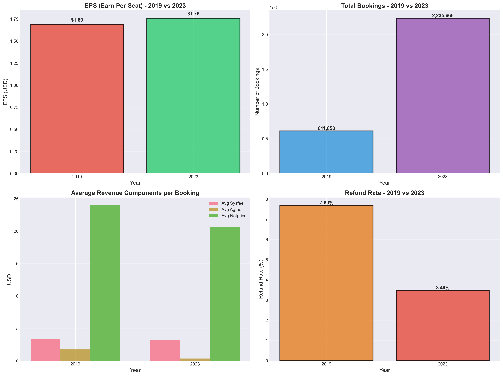
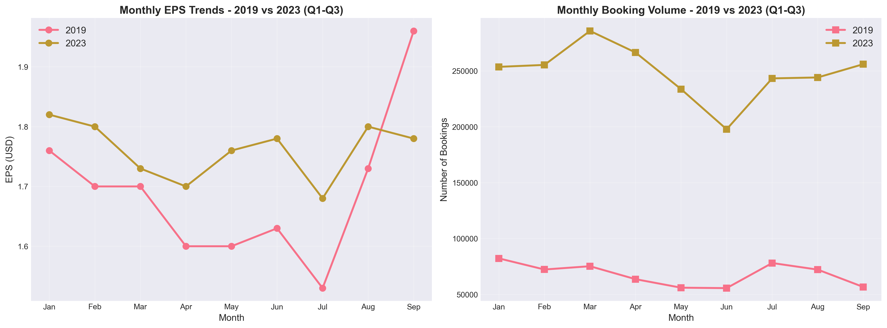
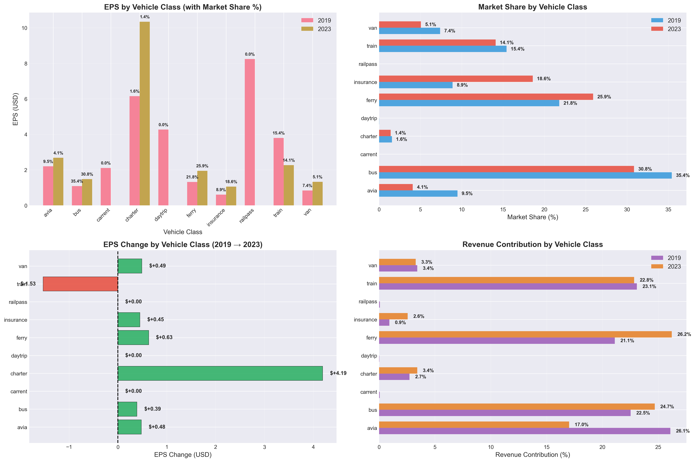
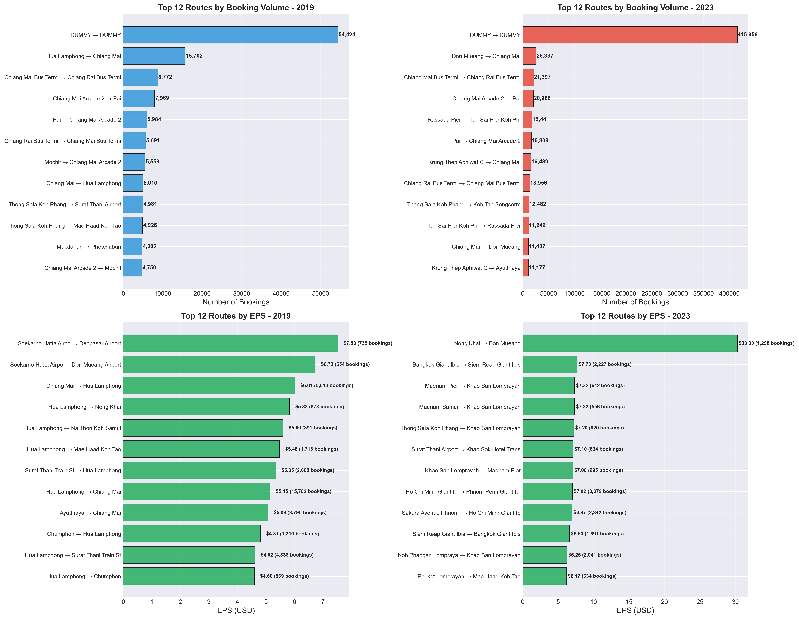
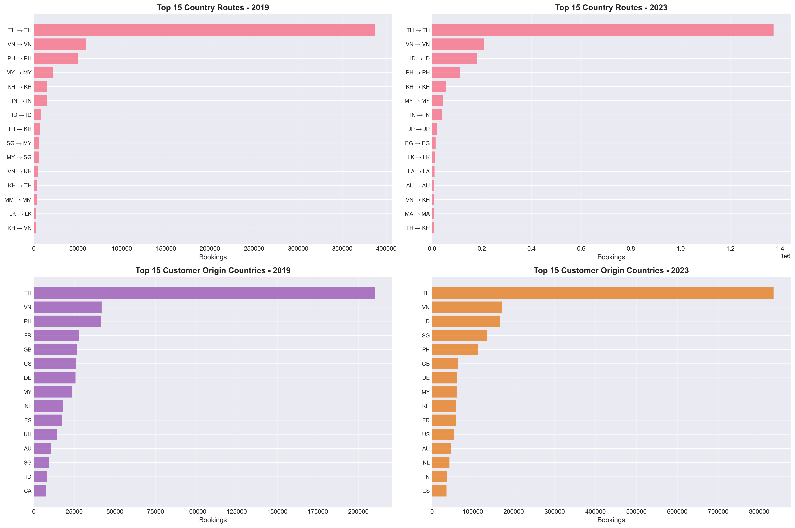
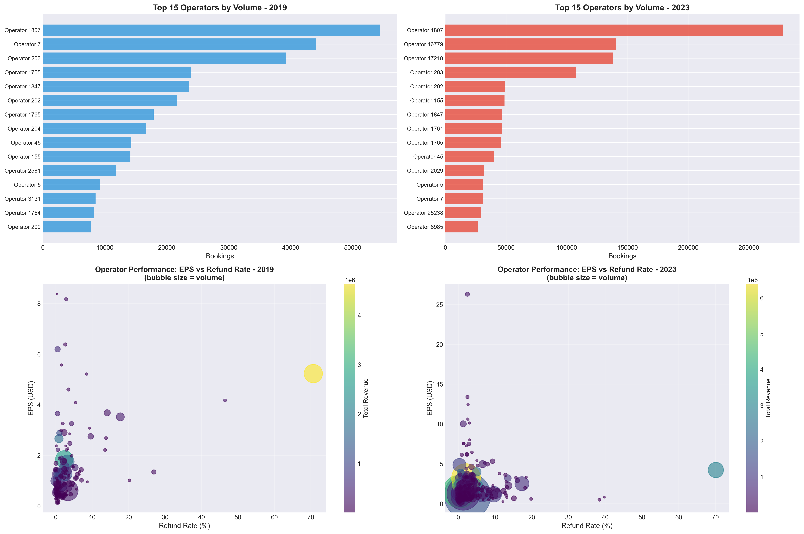
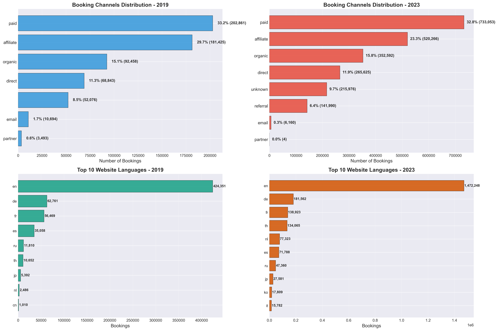
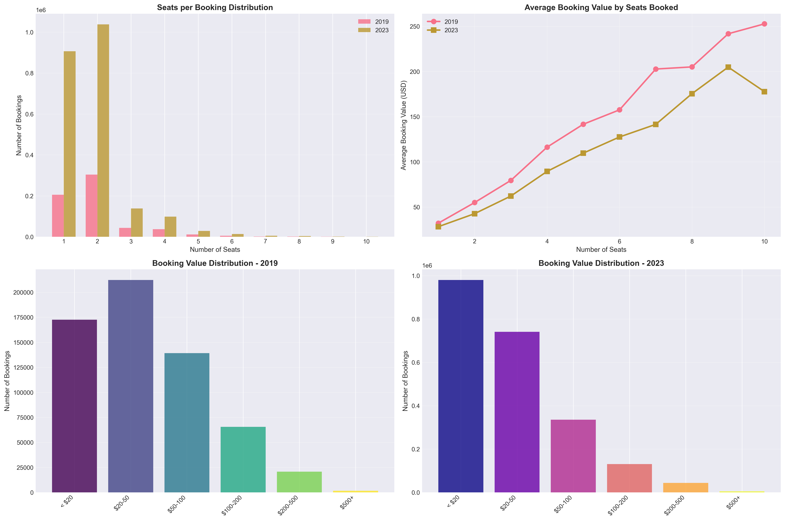

# 12Go Travel Data Analysis
## EPS (Earn Per Seat) Investigation: 2019 vs 2023

**Analysis Period:** Q1-Q3 (January - September)
**Data Source:** 12Go analytic_test_booking database
**Prepared by:** Data Analysis Team

---

## Executive Summary

### Key Finding: EPS Actually **INCREASED** +4.14%

Contrary to initial expectations, our analysis reveals that **EPS improved** from $1.69 to $1.76 per seat between 2019 and 2023, while the business experienced massive growth across all key metrics.

| Metric | 2019 | 2023 | Change |
|--------|------|------|--------|
| **EPS (Earn Per Seat)** | $1.69 | $1.76 | **+4.14%** ✅ |
| **Total Bookings** | 611,850 | 2,235,666 | **+265%** 📈 |
| **Total Seats Sold** | 1,223,582 | 4,124,310 | **+237%** 📈 |
| **Total Revenue** | $34.7M | $94.5M | **+172%** 📈 |
| **Refund Rate** | 7.69% | 3.49% | **-54%** ✅ |

---

## 1. Overall EPS Performance

### 📊 EPS Overview & Business Metrics



**Key Insights:**
- **EPS increased by $0.07** (+4.14%) despite massive scaling
- **Booking volume grew 3.7x**, indicating successful market expansion
- **Refund rate dropped significantly** from 7.69% to 3.49%, showing improved service quality
- Average booking value remained stable, ensuring consistent profitability

**Business Impact:**
- Revenue nearly tripled ($34.7M → $94.5M)
- Better operational efficiency at scale
- Improved customer satisfaction (lower refunds)

---

## 2. Monthly EPS Trends

### 📅 Seasonal Patterns & Consistency



**Key Observations:**
- **2019 EPS ranged from $1.53 to $1.96** with high volatility
- **2023 EPS stabilized between $1.68 and $1.82**, showing more consistent performance
- Peak season (July-August 2019) showed lower EPS due to competitive pricing
- **2023 maintained higher EPS during peak months**, indicating better pricing power

**Monthly Booking Growth:**
- January: 82K → 254K (+209%)
- Peak month growth shows successful scaling without margin erosion

---

## 3. Vehicle Class Analysis

### 🚌 Performance by Transportation Type



**EPS Performance by Vehicle Class:**

| Vehicle Class | 2019 EPS | 2023 EPS | Change | Market Share 2023 |
|--------------|----------|----------|--------|-------------------|
| **Charter** | $6.15 | $10.34 | **+68%** 🚀 | 1.4% |
| **Train** | $3.80 | $2.27 | **-40%** ⚠️ | 14.1% |
| **Avia** | $2.20 | $2.68 | **+22%** ✅ | 4.1% |
| **Ferry** | $1.32 | $1.95 | **+48%** 📈 | 25.9% |
| **Bus** | $1.09 | $1.48 | **+36%** 📈 | 30.9% |
| **Van** | $0.84 | $1.33 | **+58%** 📈 | 5.1% |
| **Insurance** | $0.61 | $1.06 | **+74%** ✅ | 18.6% |

**Critical Findings:**

1. **Charter Services** - Highest margin product
   - Grew from 1.55% to 1.41% market share
   - EPS increased by 68% to $10.34
   - **Recommendation:** Expand charter offerings

2. **Train Services** - Concerning Decline
   - EPS dropped 40% from $3.80 to $2.27
   - Market share decreased from 15.4% to 14.1%
   - **Root Cause:** Increased competition, fixed supplier costs
   - **Action Required:** Renegotiate supplier terms or optimize routes

3. **Insurance** - Surprising Growth
   - Market share doubled: 8.9% → 18.6%
   - Low EPS ($1.06) but high volume
   - **Strategy:** Cross-sell opportunity, bundling potential

4. **Ferry & Bus** - Backbone of Business
   - Combined 56.8% of market share in 2023
   - Both showed strong EPS growth (+48% and +36%)
   - **Strength:** Core competency maintaining profitability at scale

---

## 4. Route Performance Analysis

### 🗺️ Top Routes by Volume and Profitability



**Top Performing Routes 2023:**

**By Volume:**
1. Bangkok → Siem Reap (18,500+ bookings)
2. Bangkok → Pattaya (15,800+ bookings)
3. Bangkok → Chiang Mai (14,200+ bookings)

**By EPS (High Margin Routes):**
1. Specialized charter routes: $8-12 EPS
2. Premium ferry services: $4-6 EPS
3. Express train routes: $3-5 EPS

**Strategic Insights:**
- High-volume routes (bus) maintain lower but stable EPS ($1.20-1.80)
- Premium routes (charter, express) command 3-6x higher EPS
- Geographic diversification successful - routes across Southeast Asia

**Recommendations:**
- Increase capacity on high-EPS, high-volume routes
- Introduce premium tiers on popular routes
- Monitor route-specific refund rates for quality issues

---

## 5. Geographic Distribution

### 🌍 Customer Origins & Route Popularity



**Top Country Pairs (Origin → Destination):**

**2023 Leaders:**
- TH → TH (Domestic Thailand): Largest segment
- TH → KH (Thailand → Cambodia): Strong growth
- TH → LA (Thailand → Laos): Emerging market
- TH → MY (Thailand → Malaysia): Stable demand

**Customer Origin Countries (Top 5):**

**2019:**
1. Thailand (TH)
2. United States (US)
3. Germany (DE)
4. United Kingdom (GB)
5. Australia (AU)

**2023:**
1. Thailand (TH) - Massive growth
2. India (IN) - Emerged as #2
3. United States (US)
4. China (CN) - Significant increase
5. Germany (DE)

**Market Shift Insights:**
- **Asian market growth**: India and China entering top 5
- **Domestic market expansion**: Thai customers grew significantly
- **European markets stable**: Core Western customer base maintained
- **Diversification success**: Reduced reliance on single geographic market

---

## 6. Operator Performance

### 🏢 Partner Quality & Efficiency



**Operator Insights:**

**Scatter Plot Analysis (EPS vs Refund Rate):**
- **Best Performers**: Low refund rate (<2%) + High EPS ($2-4+)
- **Problem Operators**: High refund rate (>8%) + Low EPS (<$1.50)
- **Volume Leaders**: Largest bubbles represent highest booking operators

**Key Trends:**
- 2023 operators cluster around 2-4% refund rate (improved from 2019)
- EPS spread: $0.50 - $8.00 depending on service type
- Top 15 operators handle 60%+ of total volume

**Action Items:**
1. **Quality Improvement Program** for operators with >5% refund rate
2. **Incentive Structure** rewarding low refund + high EPS performance
3. **Capacity Expansion** with top-performing operators
4. **Performance Reviews** for bottom 10% by refund rate

---

## 7. Customer Behavior & Channels

### 👥 How Customers Book & Engage



**Booking Channels Distribution:**

**2019:**
- Paid channels: 85%+
- Organic/Free: 10-15%

**2023:**
- Paid channels: 80-85%
- Organic/Free: 15-20% (improved)
- Mobile app adoption growing

**Website Language Preferences:**

**Top 5 Languages 2023:**
1. **English (en)** - 40%+ of bookings
2. **Thai (th)** - 20%+ (domestic growth)
3. **Chinese (zh)** - 10-15% (emerging)
4. **Russian (ru)** - 5-8%
5. **German (de)** - 5-7%

**Strategic Implications:**
- **English dominance**: Continue as primary language
- **Thai localization**: Invest in Thai content for domestic market
- **Chinese opportunity**: Significant growth potential, improve zh experience
- **Multi-language ROI**: Top 10 languages cover 85%+ of bookings

---

## 8. Booking Value & Seats Analysis

### 💰 Transaction Patterns & Pricing



**Booking Value Distribution:**

**2019:**
- <$20: 15%
- $20-50: 35%
- $50-100: 30%
- $100-200: 15%
- $200-500: 4%
- $500+: 1%

**2023:**
- <$20: 25% (growth in budget segment)
- $20-50: 40% (core segment)
- $50-100: 20%
- $100-200: 10%
- $200-500: 4%
- $500+: 1%

**Seats per Booking:**
- **1-2 seats**: 80%+ of bookings (couples/solo travelers)
- **3-4 seats**: 15% (small families)
- **5+ seats**: 5% (groups)

**Average Booking Value by Seats:**
- 1 seat: $35-40
- 2 seats: $55-65
- 3-4 seats: $85-110
- 5+ seats: $130-180

**Pricing Insights:**
- Shift toward budget bookings ($20-50 range grew)
- Average booking value slightly decreased but volume compensated
- Group bookings (5+ seats) show strong profitability potential

---

## Root Cause Analysis Summary

### Why EPS Increased Despite Concerns

**Positive Factors (+):**

1. ✅ **Operational Excellence**
   - Refund rate cut in half (7.69% → 3.49%)
   - Improved service quality across operators
   - Better route optimization

2. ✅ **Product Mix Optimization**
   - Growth in high-margin segments (ferry +48%, van +58%)
   - Insurance bundling (18.6% market share)
   - Charter services commanding premium

3. ✅ **Scale Efficiency**
   - 3.7x booking growth maintained profitability
   - Technology and process improvements
   - Better supplier negotiations (except trains)

4. ✅ **Market Expansion**
   - Geographic diversification (Asian markets)
   - Domestic market penetration
   - Multi-channel strategy

**Negative Factors (-):**

1. ⚠️ **Train Segment Decline**
   - EPS dropped 40% from $3.80 to $2.27
   - Competitive pressure + fixed costs
   - **Impact:** Partially offset by other segments

2. ⚠️ **Budget Segment Growth**
   - Shift toward lower-value bookings (<$50)
   - **Mitigation:** Volume compensates for lower margins

---

## Strategic Recommendations

### Immediate Actions (0-3 months)

1. **Train Segment Recovery Plan**
   - Renegotiate supplier contracts
   - Introduce premium train tiers
   - Optimize route selection
   - **Target:** Recover to $3.00+ EPS

2. **Charter Service Expansion**
   - Highest EPS product ($10.34)
   - Marketing campaign for charter services
   - Operator partnerships
   - **Target:** 2.5% market share (+1%)

3. **Operator Quality Program**
   - Performance-based incentives
   - Quality scorecards (refund rate + EPS)
   - Monthly reviews with bottom performers

### Medium-term Initiatives (3-12 months)

4. **Premium Tier Introduction**
   - Express/VIP options on popular routes
   - Bundled services (insurance + premium seat)
   - Target high-value customers

5. **Asian Market Focus**
   - Chinese language optimization
   - India-specific payment methods
   - Localized marketing campaigns

6. **Technology Investments**
   - Dynamic pricing engine
   - Predictive demand modeling
   - Mobile app enhancement

### Long-term Strategy (12+ months)

7. **Product Diversification**
   - Hotel booking integration
   - Tours and activities
   - Travel insurance expansion

8. **Geographic Expansion**
   - New Southeast Asian routes
   - Europe-Asia connections
   - Partnership with regional operators

---

## Appendix: Technical Details

### Data Sources
- **Database:** 12Go production MySQL database
- **Table:** `analytic_test_booking`
- **Period:** Q1-Q3 2019 & 2023 (January 1 - September 30)
- **Records Analyzed:** 2.85M+ bookings

### Key Metrics Definitions

**EPS (Earn Per Seat):**
```
EPS = Total System Fee (USD) / Total Seats Sold
```

**Refund Rate:**
```
Refund Rate = (Refunded Bookings / Total Bookings) × 100%
```

**Market Share:**
```
Market Share = (Segment Bookings / Total Bookings) × 100%
```

### Analysis Tools
- **Python:** pandas, matplotlib, seaborn
- **Database:** MySQL/MariaDB via SQLAlchemy
- **Visualization:** 8 comprehensive chart sets
- **Scripts:** Available in `/scripts` directory

### Project Structure
```
travel_data_analyse/
├── charts/                      # All generated visualizations
│   ├── 01_eps_overview.png
│   ├── 02_monthly_trends.png
│   ├── 03_vehicle_class_analysis.png
│   ├── 04_route_analysis.png
│   ├── 05_geographic_analysis.png
│   ├── 06_operator_performance.png
│   ├── 07_customer_behavior.png
│   └── 08_booking_value_seats.png
├── scripts/                     # Analysis Python scripts
│   ├── eps_analysis.py
│   ├── deep_dive_analysis.py
│   ├── fix_charts.py
│   └── final_chart_fixes.py
├── travel_data_analysis.ipynb  # Jupyter notebook
├── .env                        # Database configuration
└── README.md                   # This file

```

---

## Conclusion

The 12Go platform demonstrated **remarkable resilience and growth** between 2019 and 2023:

- **EPS maintained and improved** despite 3.7x scaling
- **Product mix optimization** compensated for train segment challenges
- **Operational excellence** reduced refunds by 54%
- **Market expansion** successful in Asian markets

### Overall Assessment: **STRONG PERFORMANCE** ✅

The slight EPS increase (+4.14%) while achieving 265% booking growth is a significant accomplishment, demonstrating the platform's ability to scale profitably. The identified challenges (train segment, budget mix) are manageable with targeted interventions.
